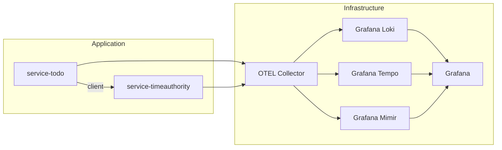
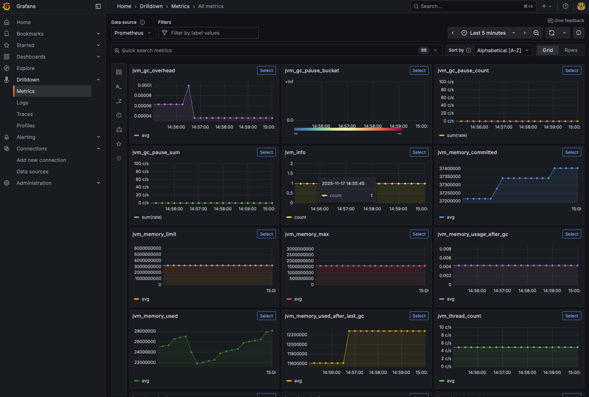
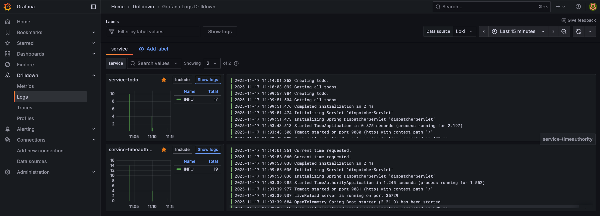
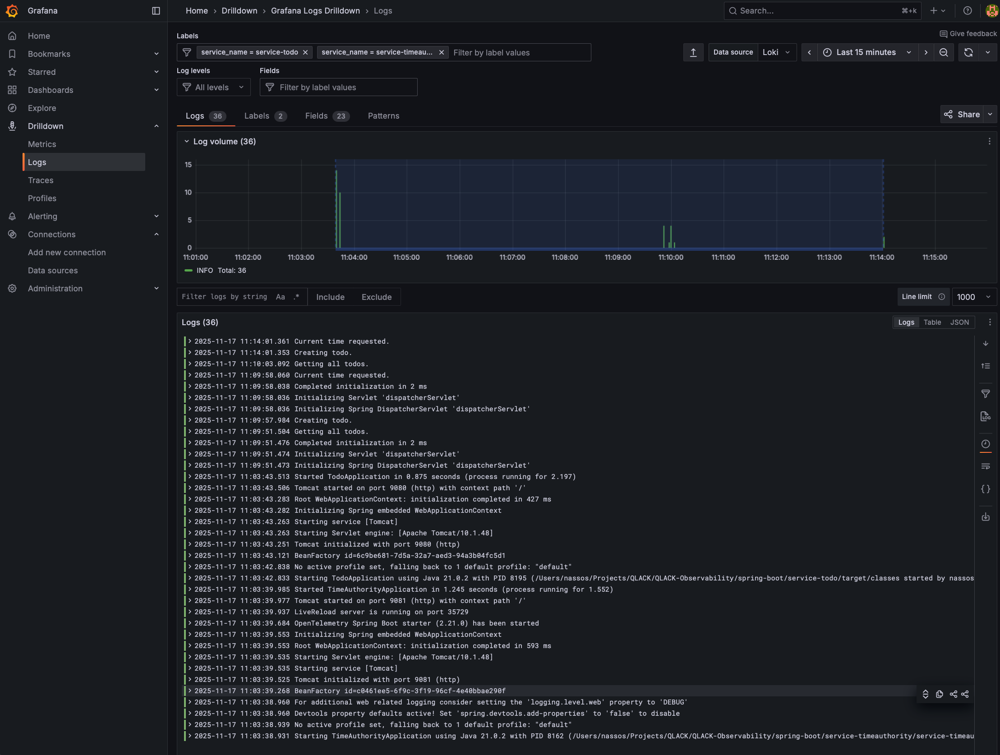
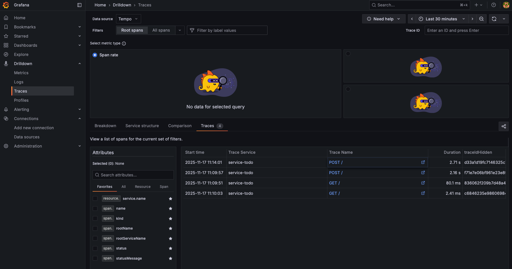
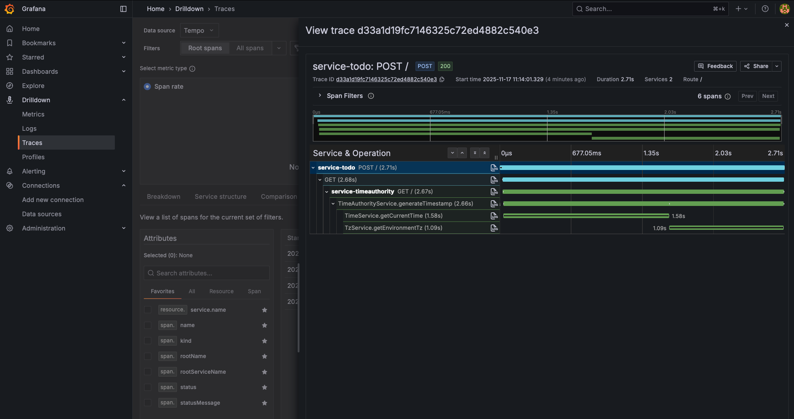

# QLACK Spring Boot Observability Demonstrator

## Architecture

This is an example project of telemetry instrumentation using Spring Boot and OpenTelemetry. Two 
different ways of instrumentation are demonstrated:

- Using OpenTelemetry Java Agent (automatic instrumentation).
- Using OpenTelemetry via a Spring Boot starter (manual instrumentation).

In both cases, telemetry data are sent to an OTEL collector and then to different Grafana backends.

The data flow is illustrated in the diagram below:

<div style="width: 60%; max-width: 800px;">



</div>

### OpenTelemetry Collector

An OpenTelemetry collector configuration is provided in `docker/collector/config.yaml` file.
It is configured to receive telemetry data and export it to Grafana backends(Loki for logs, 
Tempo for traces, and Mimir for metrics). This is a demo config that should be configured to the 
requirements of your project.

It needs to be noted that telemetry data could also be exported directly to each backend from the
origin service, however the Collector serves as an abstraction layer keeping the origin code
agnostic of the underlying technologies of the backends. Effectively, using OTLP  for exporting 
telemetry data, backends can be interchanged without having to change the origin services.

## Modules

### service-timeauthority

The `service-timeauthority` service simulates a timestamp authority providing the current time. It
demonstrates manual metrics configuration via:

- Micrometer annotations (`@Timed` annotation on `TimeAuthorityService.generateTimestamp()` method).
- A custom metric configuration (`Counter` definition in `MetricsService.init()` method).

Logs and traces are automatically instrumented via the Spring Boot OpenTelemetry starter dependency.

### service-todo

The `service-todo` service simulates a "to do list application", demonstrating automatic
instrumentation using OpenTelemetry Java Agent. You can observe that in this case, no code changes
are needed to instrument the application. The agent is attached to the application at runtime using
the `-javaagent` JVM parameter (see `dev-start.sh` and `dev-start.bat` scripts).

As of now (November 2025), the Java Agent has more out-of-the-box instrumentation than Spring Boot
starter, with the drawback that the service JAR must be started with the agent JAR file. This is a
straightforward process, usually done in the startup script of the application, however it may pause
some adoption challenges in certain environments, especially when working with native images. The
upside is that it can be used with any existing Java 8+ application without having to modify the
application's source code.

## How to start and test the demonstrators

1. Have Maven 3.9.x, JDK 21, and a recent Docker Engine installed.
2. Build the project from root with `mvn clean install`:
3. Start the supporting infrastructure with Docker Compose via `docker compose up`:

    ```bash
    cd docker
    docker compose up
    ```
4. Start the two service modules in two separate terminal windows:

    - For `service-timeauthority` module:

      <details>
      <summary>Linux/macOS</summary>

      ```bash
      cd service-timeauthority
      ./dev-start.sh
      ```
      </details>

      <details>
      <summary>Windows</summary>

      ```bat
      cd service-timeauthority
      dev-start.bat
      ```
      </details>

    - For `service-todo` module:

      <details>
      <summary>Linux/macOS</summary>

      ```bash
      cd service-todo
      ./dev-start.sh
      ```
      </details>

      <details>
      <summary>Windows</summary>

      ```bat
      cd service-todo
      dev-start.bat
      ```
      </details>
5. Issue some test requests:

    - Create a todo item:

      <details>
      <summary>Linux/macOS</summary>

      ```bash
      curl -X POST http://localhost:9080/ \
        -H "Content-Type: application/json" \
        -d '{
          "title": "My First Todo",
          "description": "This is a test todo item"
        }'
      ```
      </details>

      <details>
      <summary>Windows (PowerShell)</summary>

      ```powershell
      curl -X POST http://localhost:9080/ `
        -H "Content-Type: application/json" `
        -d '{
          "title": "My First Todo",
          "description": "This is a test todo item"
        }'
      ```
      </details>

    - Create another todo item:

      <details>
      <summary>Linux/macOS</summary>

      ```bash
      curl -X POST http://localhost:9080/ \
        -H "Content-Type: application/json" \
        -d '{
          "title": "My Second Todo",
          "description": "This is another test todo item"
        }'
      ```
      </details>

      <details>
      <summary>Windows (PowerShell)</summary>

      ```powershell
      curl -X POST http://localhost:9080/ `
        -H "Content-Type: application/json" `
        -d '{
          "title": "My Second Todo",
          "description": "This is another test todo item"
        }'
      ```
      </details>

    - List all todo items:

      ```bash
      curl -X GET "http://localhost:9080"
      ```
6. Login to Grafana at `http://localhost:3000` (default credentials: `admin`/`admin`).
7. You can explore the observability data under 'Drilldown' menu.  Note that it may take a few 
seconds for the data to appear:

    - **Metrics**:
   
    - **Logs**:
   
   
    - **Traces**:
   
   
